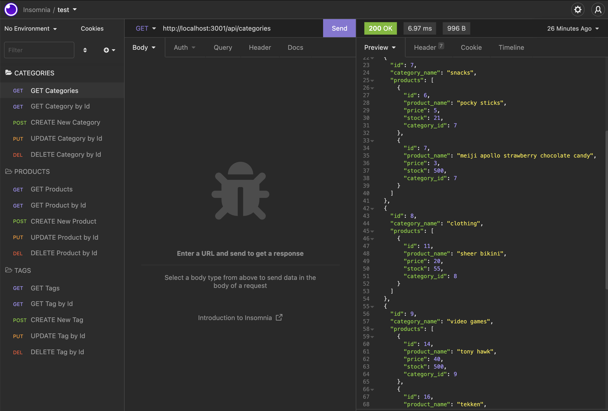

# Online Store BACK-END

Back end for online store that interacts with a MySQL database. Demonstrates GET, POST, PUT, DELETE routes.

## Installation

Clone repository, open Terminal. This application makes use of Node.js. Install dependencies using ``npm i``. Fill out the .env to be able to connect to the database. Load the schema using MySQL Workbench or Shell, and seed the database by running ``npm run seed``. Start the server by running ``npm run start`` or ``npm run watch``.

## Usage

Using Insomnia, test GET routes for all categories, products, and tags. Also test GET routes for specific categories, products, and tags. Finally, test POST, PUT, and DELETE routes for categories, products, and tags.

 An example of GET categories

Watch these walkthrough videos, [part 1](https://drive.google.com/file/d/1Ihe7YG9ZzX5kOwFSiU0RYFT2_0Y4oCyd/view) and [part 2](https://drive.google.com/file/d/10GsRoWTtOyRuVtaT9W12gSJpTt8Zyqe4/view)! To get a better sense of the whole application!

## Credits

- [Node.js](https://nodejs.org/en/)

- [Express.js](https://www.npmjs.com/package/express)

- [MySQL2](https://www.npmjs.com/package/mysql2)

- [Sequelize](https://www.npmjs.com/package/sequelize)

- [Insomnia](https://insomnia.rest/)

- [dotenv](https://www.npmjs.com/package/dotenv)

## License

Copyright (c) 2022 stardust productions.

Licensed under the MIT License